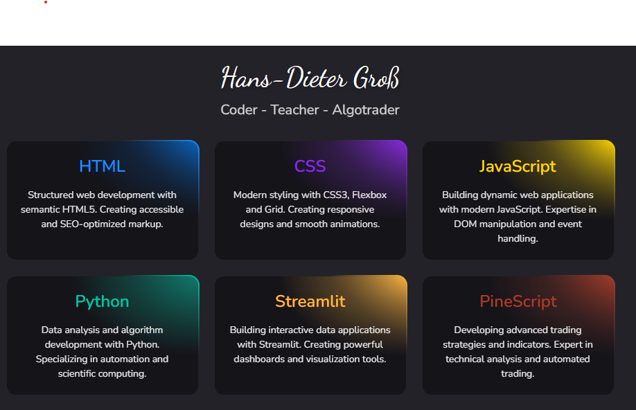

  

#  Welcome! 
  
---

I am a Developer and AI Enthusiast with a huge love for Python, Javascript, Node.js, Pinescript and Algo Trading. 

- ✨ Coder for life :)

- 🌱 I’m currently learning new things everyday. What will be next tomorrow?

- 💁‍♂️ Creator of <a href="https://masteroftheformulas.weebly.com">my Tutorials and Exercise Page</a>

- ✍ You can read my articles about AI, Algotrading at <a href="https://linkedin.com/in/hansdietergroß">LinkedIn</a>

---
<!--Languages and Tools Section-->       
<h2 align="center">Tᴇᴄʜ sᴛᴀᴄᴋ & Lᴀᴛᴇsᴛ ʙʟᴏɢs</h2> 
<picture>
  <source media="(prefers-color-scheme: dark)" srcset="SkillsDark.gif">
  <source media="(prefers-color-scheme: light)" srcset="SkillsWhite.gif">
  
</picture>
 
  
<h3 align="left">Latest LinkedIn Posts</h3>
<ul align="left">
  <li><a href="https://www.linkedin.com/pulse/save-time-space-must-have-tool-every-computer-use-hans-dieter-gro%25C3%259F-515vc/?trackingId=nlevWupN4%2FmXcd3sfK%2FAXQ%3D%3D">
       ⌛Save Time and Space: The Must-Have Tool for Every Computer Use</a>
  </li>
  <li><a href="https://www.linkedin.com/pulse/from-work-wellness-how-notebooklm-makes-life-smarter-hans-dieter-gro%25C3%259F-phodc/?trackingId=eFhdxckMxtIe3hEnC197qQ%3D%3D">
    🏆Rebuilding Success: Insights from an IT Teacher and a Developer</a>
  </li>
  <li><a href="https://www.linkedin.com/pulse/rebuilding-success-insights-from-teacher-developer-hans-dieter-gro%25C3%259F-kdktc/?trackingId=TVz%2F0vv3TxZDCoBxnlybNA%3D%3D">
    🌱From Work to Wellness: How NotebookLM Makes Life Smarter</a>
  </li>
  <li><a href="https://www.linkedin.com/pulse/napkin-ai-transform-texts-stunning-graphics-hans-dieter-gro%25C3%259F-hfw8c/">
    🎨Napkin AI: Transform Texts into Stunning Graphics!</a>
  </li>
  <li><a href="https://www.linkedin.com/pulse/notebooklm-next-generation-chatgpt-hans-dieter-gro%25C3%259F-kipac/">
    🔜NotebookLM - The next generation of ChatGPT?</a>
  </li>
  <li><a href="https://www.linkedin.com/pulse/ai-powered-prompt-engineering-revolutionize-your-sql-exam-gro%25C3%259F-bffkc/">
   🧑‍🏫️AI-Powered Prompt Engineering: Revolutionize Your SQL Exam Creation Process</a>
  </li>
</ul>
    

---

<h3 align="center"><strong>Gɪᴛʜᴜʙ Sᴛᴀᴛs</strong></h3>

       

<h3 align="center"><strong>Lᴀᴛᴇsᴛ Pʀᴏᴊᴇᴄᴛ</strong></h3>

   

<h3 align="center"><strong>Pʀᴏɢʀᴀᴍᴍɪɴɢ Lᴀɴɢᴜᴀɢᴇs</strong></h3>

  

---

<h2 align="center">🤝 Cᴏɴɴᴇᴄᴛ Wɪᴛʜ Mᴇ 🤝 </h2>

  

